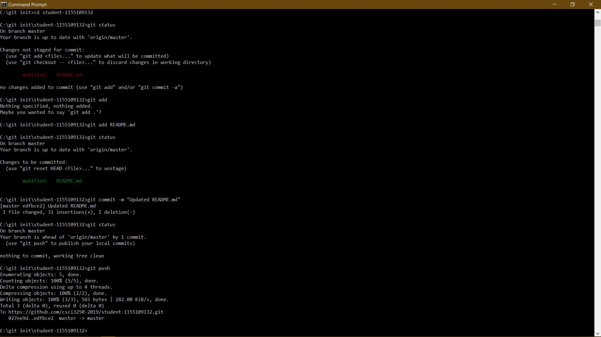

# student-1155109132
## LI Fung Siu
My name is Li Fung Siu.
I am happy to be a developer.
I am new in GitHub but I am getting good in it.

The following is the use of Header:
# This is Header

The following is the use of Emphasis:
*This is Italic*
**This is Bold**

The following is the use of List:
* Unordered item 1
* Unordered item 2
  * Unordered item 2a
1. Ordered item 1
2. Ordered item 2
  1. Ordered item 2.1

The following is the use of Task List:
- [ ] Unchecked task
- [X] Checked task

The following is the use of Table:
| Student ID | Name |
| ---------- | ---- |
| 1155100000 | Andy |
| 1155100001 | Ben |
| 1155100002 | Cherry |
| 1155100003 | Doll |

The following is the use of Image:

